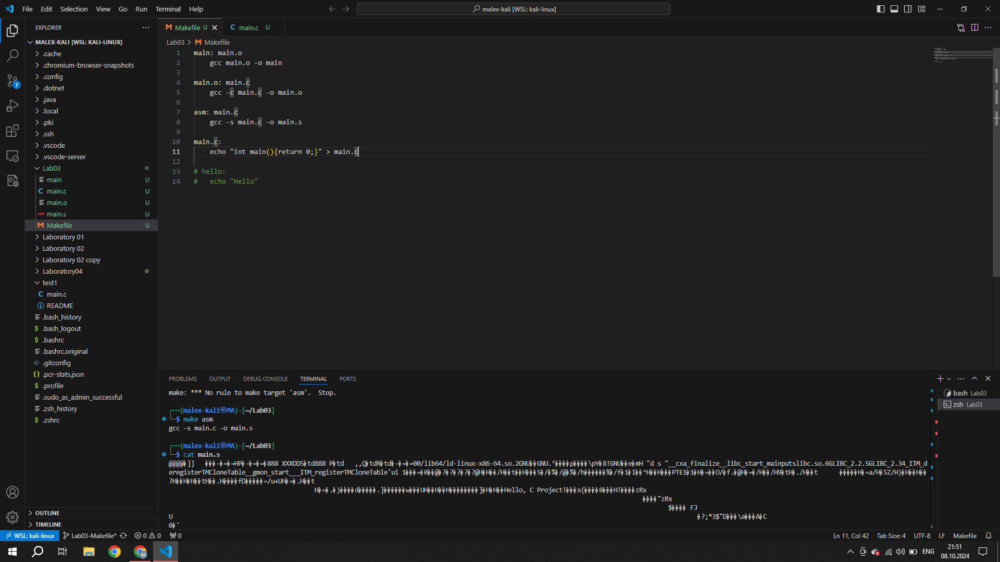
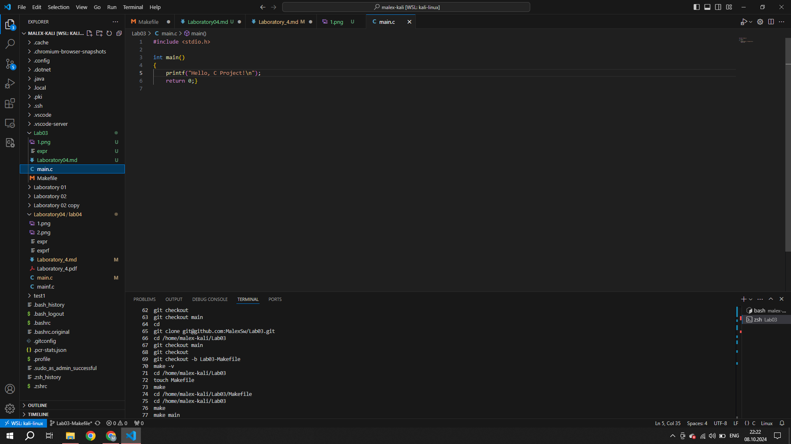

# Report 3

### Firstly I have cloned a project from Github, created new branch and created Makefile

>git clone git@github.com:MalexSw/Lab03.git            
>cd /home/malex-kali/Lab03      
>git checkout main      
>git checkout       
>git checkout -b Lab03-Makefile     
>make -v        
>cd /home/malex-kali/Lab03      
>touch Makefile

### Then I created some functions with name "main" and tried command "echo"

>main: main.o                     
	gcc main.o -o main
>
>main.o: main.c             
	gcc -c main.c -o main.o
>
>asm: main.c                
	gcc -s main.c -o main.s
>
>main.c:            
	echo "int main(){return 0;}" > main.c
>
>clean:         
	rm -f *.o *.s main
>
> #hello:           
> #echo "Hello"

### After this I have created file "main.c" and created some code there

### And debugged it with gbd

>┌──(malex-kali㉿MA)-[~/Lab03]          
>└─$ gcc -g -O0 main.c -o expr    
>
>(malex-kali㉿MA)-[~/Lab03]         
>└─$gdb ./expr                                             
GNU gdb (Debian 13.2-1+b2) 13.2         
Copyright (C) 2023 Free Software Foundation, Inc.           
License GPLv3+: GNU GPL version 3 or later <http://gnu.org/licenses/gpl.html>     
This is free software: you are free to change and redistribute it.      
There is NO WARRANTY, to the extent permitted by law.       
Type "show copying" and "show warranty" for details.        
This GDB was configured as "x86_64-linux-gnu".      
Type "show configuration" for configuration details.        
For bug reporting instructions, please see:     
<https://www.gnu.org/software/gdb/bugs/>.       
Find the GDB manual and other documentation resources online at:        
    <http://www.gnu.org/software/gdb/documentation/>.
>
>For help, type "help".     
Type "apropos word" to search for commands related to "word"...     
--Type <RET> for more, q to quit, c to continue without paging--c       
Reading symbols from ./expr...      
(gdb) r     
Starting program: /home/malex-kali/Lab03/expr       
[Thread debugging using libthread_db enabled]       
Using host libthread_db library "/lib/x86_64-linux-gnu/libthread_db.so.1".      
Hello, C Project!           
[Inferior 1 (process 13108) exited normally]        
(gdb) q         

### And, finally, I have created cleaned trashed and uploaded files into github

>┌──(malex-kali㉿MA)-[~/Lab03]      
└─$ make clean      
rm -f *.o *.s main

>(malex-kali㉿MA)-[~/Lab03]     
└─$ git status                           
On branch Lab03-Makefile        
>
>No commits yet
>
>Untracked files:       
  (use "git add <file>..." to include in what will be committed)        
        Makefile        
        main.c      
>       
>nothing added to commit but untracked files present (use "git add" to track)       

>┌──(malex-kali㉿MA)-[~/Lab03]      
└─$ git add Makefile           

>┌──(malex-kali㉿MA)-[~/Lab03]      
└─$ git add main.c  
   
>┌──(malex-kali㉿MA)-[~/Lab03]      
└─$ git commit -m "Added new Makefile"    
>      
>[Lab03-Makefile (root-commit) 85f9991] Added new Makefile       
 2 files changed, 23 insertions(+)      
 create mode 100644 Makefile        
 create mode 100644 main.c      
>
>┌──(malex-kali㉿MA)-[~/Lab03]      
└─$ git push                          
fatal: The current branch Lab03-Makefile has no upstream branch.        
To push the current branch and set the remote as upstream, use
>
>   git push --set-upstream origin Lab03-Makefile
>
>To have this happen automatically for branches without a tracking
upstream, see 'push.autoSetupRemote' in 'git help config'.
                             
>┌──(malex-kali㉿MA)-[~/Lab03]      
└─$ git push --set-upstream origin Lab03-Makefile       
Enumerating objects: 4, done.       
Counting objects: 100% (4/4), done.     
Delta compression using up to 20 threads        
Compressing objects: 100% (4/4), done.      
Writing objects: 100% (4/4), 460 bytes | 230.00 KiB/s, done.        
Total 4 (delta 0), reused 0 (delta 0), pack-reused 0        
To github.com:MalexSw/Lab03.git     
 >* [new branch]      Lab03-Makefile -> Lab03-Makefile       
branch 'Lab03-Makefile' set up to track 'origin/Lab03-Makefile'.       

#### Problems: I haven't used part of code for x86 and x86_64