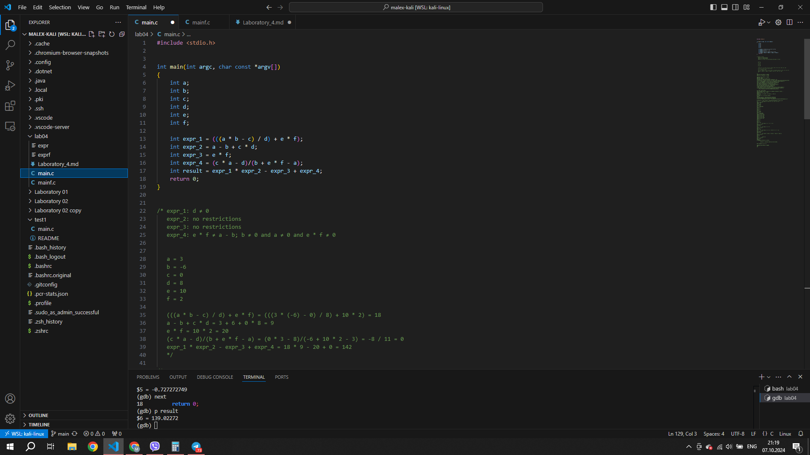
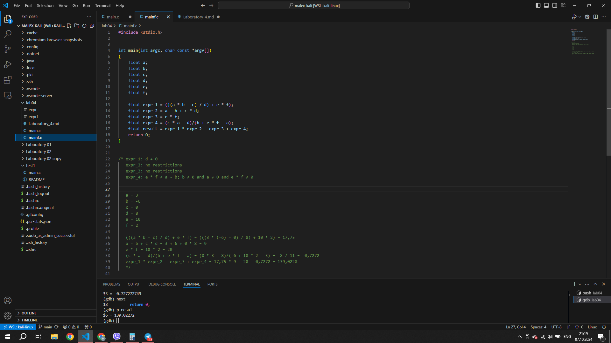

# Report 4

## Main with integer

#### I begun with creating a programm with int data type

#### Text of debugging

>┌──(malex-kali㉿MA)-[~/lab04]   
>└─$ gcc -g -O0 main.c -o expr
>
>┌──(malex-kali㉿MA)-[~/lab04]   
└─$ gdb ./expr
GNU gdb (Debian 13.2-1+b2) 13.2   
Copyright (C) 2023 Free Software Foundation, Inc.
License GPLv3+: GNU GPL version 3 or later <http://gnu.org/licenses/gpl.html>
This is free software: you are free to change and redistribute it.
There is NO WARRANTY, to the extent permitted by law.
Type "show copying" and "show warranty" for details.
This GDB was configured as "x86_64-linux-gnu".
Type "show configuration" for configuration details.
For bug reporting instructions, please see:
<https://www.gnu.org/software/gdb/bugs/>.
--Type <RET> for more, q to quit, c to continue without paging--c
Find the GDB manual and other documentation resources online at:
    <http://www.gnu.org/software/gdb/documentation/>.
>
>For help, type "help".     
Type "apropos word" to search for commands related to "word"...    
Reading symbols from ./expr...     
(gdb) b 7    
Breakpoint 1 at 0x1134: file main.c, line 13.    
(gdb) p a    
No symbol "a" in current context.   
(gdb) r   
Starting program: /home/malex-kali/lab04/expr    
[Thread debugging using libthread_db enabled]   
Using host libthread_db library "/lib/x86_64-linux-gnu/libthread_db.so.1".   
>
>Breakpoint 1, main (argc=1, argv=0x7fffffffdf38) at main.c:13     
13          int expr_1 = (((a * b - c) / d) + e * f);   
(gdb) whatis a   
type = int   
(gdb) p a   
$1 = 32767  
(gdb) p b   
$2 = -134227280 
(gdb) p c   
$3 = 0  
(gdb) p d   
$4 = 0  
(gdb) p e   
$5 = 32767  
(gdb) p f   
$6 = -134321088 
(gdb) set var a=3   
(gdb) set var b=-6  
(gdb) set var c=0   
(gdb) set var d=8   
(gdb) set var e=10  
(gdb) set var f=2   
(gdb) p a   
$7 = 3  
(gdb) p c   
$8 = 0  
(gdb) next  
14          int expr_2 = a - b + c * d; 
(gdb) p expr_1  
$9 = 18 
(gdb) next   15          int expr_3 = e * f;     
(gdb) p expr_2  
$10 = 9 
(gdb) next  
16          int expr_4 = (c * a - d)/(b + e * f - a);   
(gdb) p expr_3          
$11 = 20
(gdb) next      
17          int result = expr_1 * expr_2 - expr_3 + expr_4;     
(gdb) p expr_4  
$12 = 0 
(gdb) n     
18          return 0;           
(gdb) p result          
$13 = 142           
(gdb) q         
A debugging session is active.          
>
>Inferior 1 [process 4116] will be killed.           
>
>Quit anyway? (y or n) y         
>
>┌──(malex-kali㉿MA)-[~/lab04]           
>└─$         

## Main with float

#### Then I created a programm with float data type

#### Text of debugging

>┌──(malex-kali㉿MA)-[~/lab04]       
└─$ cd /home/malex-kali/lab04
>
>┌──(malex-kali㉿MA)-[~/lab04]  
└─$ gcc -g -O0 mainf.c -o exprf
>
>┌──(malex-kali㉿MA)-[~/lab04]  
└─$ gdb ./exprf         
GNU gdb (Debian 13.2-1+b2) 13.2         
Copyright (C) 2023 Free Software Foundation, Inc.           
License GPLv3+: GNU GPL version 3 or later <http://gnu.org/licenses/gpl.html>       
This is free software: you are free to change and redistribute it.      
There is NO WARRANTY, to the extent permitted by law.       
Type "show copying" and "show warranty" for details.        
This GDB was configured as "x86_64-linux-gnu".      
Type "show configuration" for configuration details.        
For bug reporting instructions, please see:     
<https://www.gnu.org/software/gdb/bugs/>.       
--Type <RET> for more, q to quit, c to continue without paging--c       
Find the GDB manual and other documentation resources online at:        
    <http://www.gnu.org/software/gdb/documentation/>.       
>
>For help, type "help".      
Type "apropos word" to search for commands related to "word"...          
Reading symbols from ./exprf...     
(gdb) b main        
Breakpoint 1 at 0x1134: file mainf.c, line 13.      
(gdb) r     
Starting program: /home/malex-kali/lab04/exprf      
[Thread debugging using libthread_db enabled]       
Using host libthread_db library "/lib/x86_64-linux-gnu/libthread_db.so.1".      
>
>Breakpoint 1, main (argc=1, argv=0x7fffffffdf38) at mainf.c:13      
13          float expr_1 = (((a * b - c) / d) + e * f);     
(gdb) ptype a       
type = float        
(gdb) set var a=3       
(gdb) set var b=-6      
(gdb) set var c=0       
(gdb) set var d=8       
(gdb) set var e=10      
(gdb) Quit      
(gdb) set var f=2       
(gdb) p a       
$1 = 3      
(gdb) next      
14          float expr_2 = a - b + c * d;       
(gdb) p expr_1      
$2 = 17.75      
(gdb) next      
15          float expr_3 = e * f;       
(gdb) p expr_2      
$3 = 9      
(gdb) next      
16          float expr_4 = (c * a - d)/(b + e * f - a);     
(gdb) p expr_3      
$4 = 20     
(gdb) next      
17          float result = expr_1 * expr_2 - expr_3 + expr_4;       
(gdb) p expr_4      
$5 = -0.727272749       
(gdb) next      
18          return 0;       
(gdb) p result      
$6 = 139.02272      
(gdb) q     
A debugging session is active.      
>
 >Inferior 1 [process 10490] will be killed.
>
>Quit anyway? (y or n) y
>
>┌──(malex-kali㉿MA)-[~/lab04]      
>└─$ 