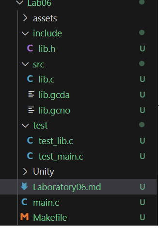
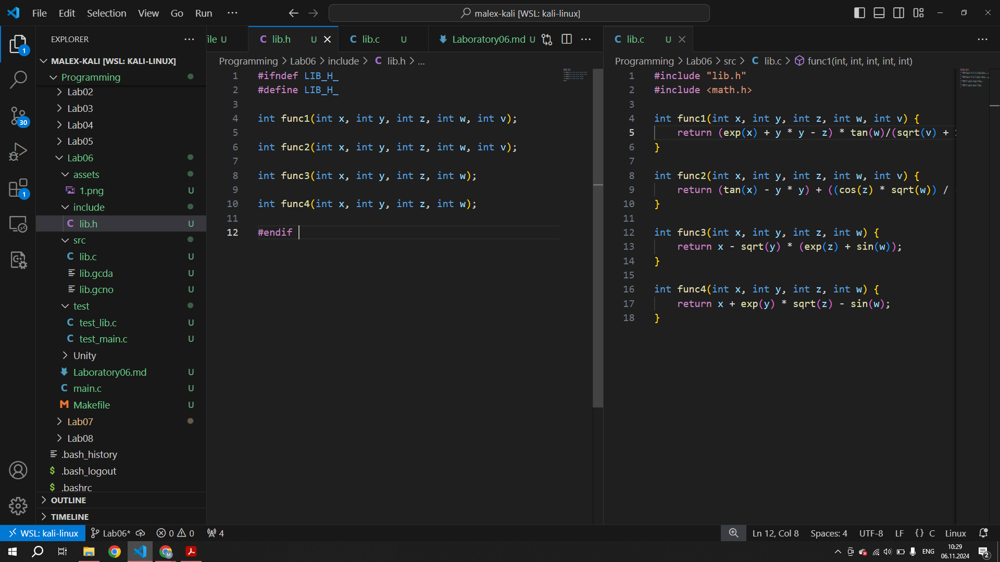
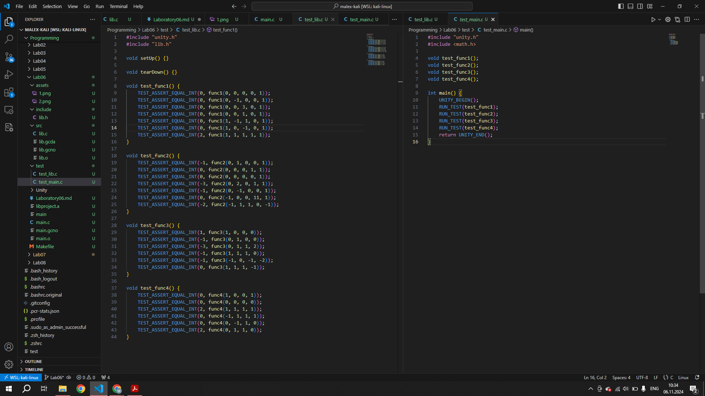
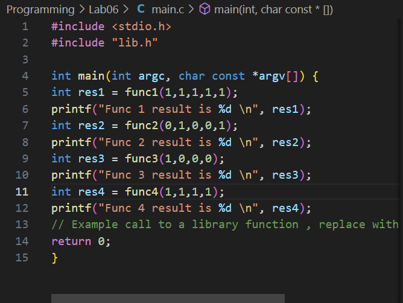

# Report 6

## Unity test

#### In this laboratory work I created a library, which was able to perform 4 different operations in different functions. For them also were created unity-based test.

#### It has such structure

#### Firstly I created lib.h and lib.c files, where my library operations were described, and Makefile, which code I took from pdf-task file. After I created main.c file, which will be used in future as functions usage example

#### Output of my programm on this syep is such:

>┌──(malex-kali㉿MA)-[~/Programming/Lab06]  
└─$ make all
gcc -Wall -Iinclude -IUnity/src -fprofile-arcs -ftest-coverage -c main.c    
gcc -Wall -Iinclude -IUnity/src -fprofile-arcs -ftest-coverage -c src/lib.c -o src/lib.o    
ar rcs libproject.a src/lib.o   
gcc -Wall -Iinclude -IUnity/src -fprofile-arcs -ftest-coverage -o main main.o libproject.a -L. -fprofile-arcs -ftest-coverage -lm

#### Then I uploaded Unity folder, which is obligatory for tests making and started tests creating in test_lib.c and test_main.c files. My tests try different values, which makes possible failures find. 

#### The output of my tests is the next

>┌──(malex-kali㉿MA)-[~/Programming/Lab06]  
└─$ make test   
gcc -Wall -Iinclude -IUnity/src -fprofile-arcs -ftest-coverage -c src/lib.c -o src/lib.o    
ar rcs libproject.a src/lib.o   
gcc -Wall -Iinclude -IUnity/src -fprofile-arcs -ftest-coverage -o run_tests Unity/src/unity.c test/test_lib.c test/test_main.c -L. -lproject -L. -fprofile-arcs -ftest-coverage -lm 
./run_tests     
test/test_main.c:11:test_func1:PASS
test/test_main.c:12:test_func2:PASS
test/test_main.c:13:test_func3:PASS
test/test_main.c:14:test_func4:PASS
>
>-----------------------
>4 Tests 0 Failures 0 Ignored       
>OK

#### So this output mean, that my functions and tests are working correctly

#### On the last step I also modefied main.c fail, so now it use akk fout functions from library.

