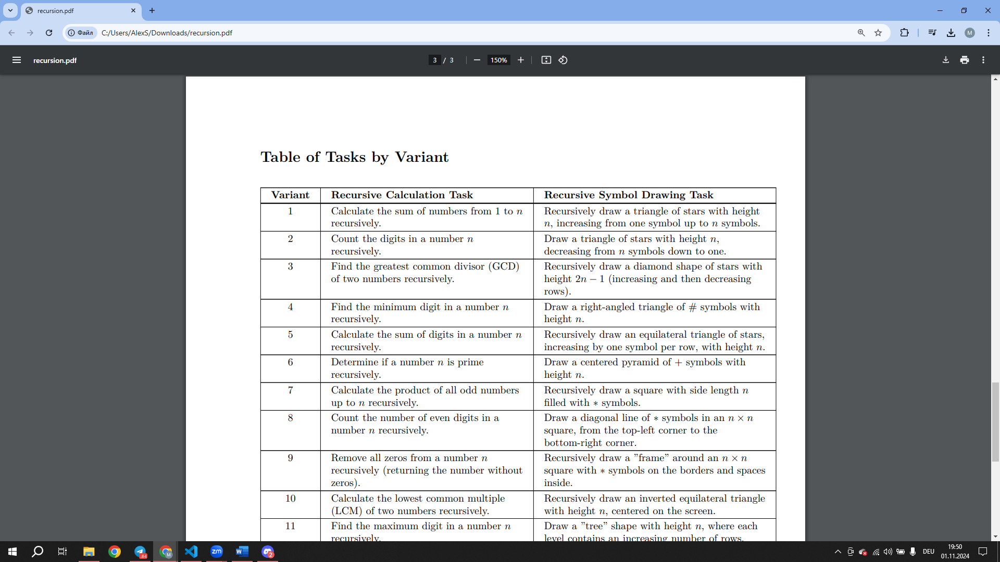

# Report 7

## Recursion

#### In this laboratory work I created a programm, which can do two tasks - recursion and drawing.

#### Here is my task - option number 6.

#### Firstly I created a file with name "main.c", which had recursion calculation algorithm founded on "return" command. 
#### Then I created file "mainOpt.c". I changed it main recursion algorithm to loop with command "for".

## Here is th output of "main.c" file.

>┌──(malex-kali㉿MA)-[~/Programming/Lab07]      
>└─$ gcc -g -O0 main.c -o expr
>
>┌──(malex-kali㉿MA)-[~/Programming/Lab07]      
>└─$ gdb ./expr     
GNU gdb (Debian 13.2-1+b2) 13.2     
Copyright (C) 2023 Free Software Foundation, Inc.       
License GPLv3+: GNU GPL version 3 or later <http://gnu.org/licenses/gpl.html>       
This is free software: you are free to change and redistribute it.      
There is NO WARRANTY, to the extent permitted by law.       
Type "show copying" and "show warranty" for details.        
This GDB was configured as "x86_64-linux-gnu".      
Type "show configuration" for configuration details.        
For bug reporting instructions, please see:     
--Type <RET> for more, q to quit, c to continue without paging--c
<https://www.gnu.org/software/gdb/bugs/>.       
Find the GDB manual and other documentation resources online at:
    <http://www.gnu.org/software/gdb/documentation/>.       
>
>For help, type "help".     
Type "apropos word" to search for commands related to "word"...     
Reading symbols from ./expr...      
(gdb) r     
Starting program: /home/malex-kali/Programming/Lab07/expr        
[Thread debugging using libthread_db enabled]       
Using host libthread_db library "/lib/x86_64-linux-gnu/     libthread_db.so.1".     
TRUE        
>
>
>
>----------------------------------------------------- 
>
>
>               +        
>              +++       
>             +++++      
>            +++++++     
>           +++++++++        
>          +++++++++++
>         +++++++++++++      
>        +++++++++++++++       
>       +++++++++++++++++  
>      +++++++++++++++++++     
>    +++++++++++++++++++++    
>[Inferior 1 (process 7892) exited normally]    
>(gdb) q

## Output for "mainOpt.c" file

>┌──(malex-kali㉿MA)-[~/Programming/Lab07]      
>└─$ gcc -g -O0 mainOpt.c -o exprOpt
>
>┌──(malex-kali㉿MA)-[~/Programming/Lab07]      
>└─$ gdb ./exprOpt     
GNU gdb (Debian 13.2-1+b2) 13.2     
Copyright (C) 2023 Free Software Foundation, Inc.       
License GPLv3+: GNU GPL version 3 or later <http://gnu.org/licenses/gpl.html>       
This is free software: you are free to change and redistribute it.      
There is NO WARRANTY, to the extent permitted by law.       
Type "show copying" and "show warranty" for details.        
This GDB was configured as "x86_64-linux-gnu".      
Type "show configuration" for configuration details.        
For bug reporting instructions, please see:     
--Type <RET> for more, q to quit, c to continue without paging--c
<https://www.gnu.org/software/gdb/bugs/>.       
Find the GDB manual and other documentation resources online at:
    <http://www.gnu.org/software/gdb/documentation/>.       
>
>For help, type "help".     
Type "apropos word" to search for commands related to "word"...     
Reading symbols from ./exprOpt...      
(gdb) r     
Starting program: /home/malex-kali/Programming/Lab07/exprOpt        
[Thread debugging using libthread_db enabled]       
Using host libthread_db library "/lib/x86_64-linux-gnu/     libthread_db.so.1".     
TRUE        
>
>
>
>----------------------------------------------------- 
>
>
>               +        
>              +++       
>             +++++      
>            +++++++     
>           +++++++++        
>          +++++++++++
>         +++++++++++++      
>        +++++++++++++++       
>       +++++++++++++++++  
>      +++++++++++++++++++     
>    +++++++++++++++++++++    
>[Inferior 1 (process 7892) exited normally]    
>(gdb) q

#### These two outputs were generated with input value "11". Then, to check what is th difference in speed between these two versions of programms, I put "74789380547" as input value, disconnected drawing function and tested time.
For "main.c" it is the next:
>real    0m0.002s       
>user    0m0.002s       
>sys     0m0.000s

And for "mainOpt.c" it is:
>real    0m0.001s       
>user    0m0.001s       
>sys     0m0.000s       