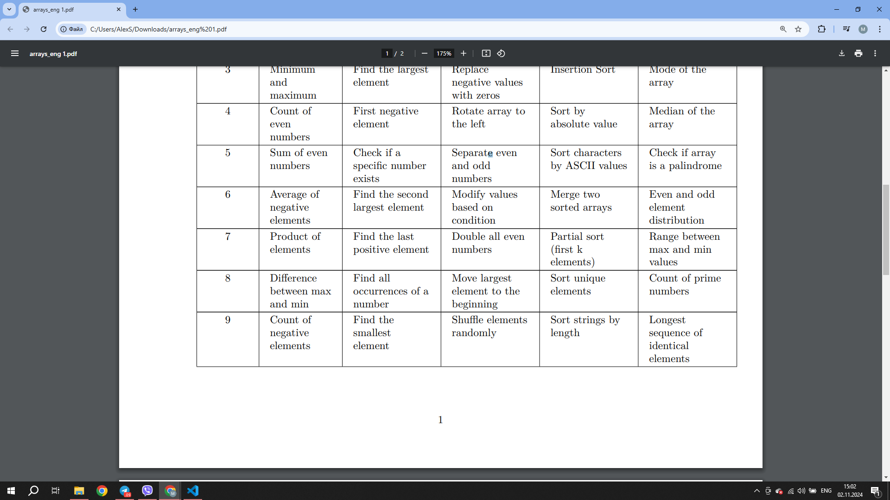

# Report 7

## Recursion

#### In this laboratory work I created a programm, which can do five different tasks with arrays.

#### Here is my task - option number 6.

#### In this programm I have main function, and five other. Each is called from main and get amount of symbols for array from there.

## First function - it can find the average value of negative values in created array 

#### Output

>┌──(malex-kali㉿MA)-[~/Programming/Lab08]   
>└─$ gcc -g -O0 main.c -o expr
>
>┌──(malex-kali㉿MA)-[~/Programming/Lab08]  
└─$ gdb ./expr          
GNU gdb (Debian 13.2-1+b2) 13.2 
Copyright (C) 2023 Free Software Foundation, Inc.   
License GPLv3+: GNU GPL version 3 or later <http://gnu.org/licenses/gpl.html>   
This is free software: you are free to change and redistribute it.  
There is NO WARRANTY, to the extent permitted by law.   
--Type <RET> for more, q to quit, c to continue without paging--c   
Type "show copying" and "show warranty" for details.    
This GDB was configured as "x86_64-linux-gnu".  
Type "show configuration" for configuration details.    
For bug reporting instructions, please see:
<https://www.gnu.org/software/gdb/bugs/>.   
Find the GDB manual and other documentation resources online at:
    <http://www.gnu.org/software/gdb/documentation/>.
>       
>For help, type "help".     
Type "apropos word" to search for commands related to "word"...     
Reading symbols from ./expr...      
(gdb) r     
Starting program: /home/malex-kali/Programming/Lab08/expr       
[Thread debugging using libthread_db enabled]       
Using host libthread_db library "/lib/x86_64-linux-gnu/     libthread_db.so.1".    
0 14 -2 3 2 6 -2 12 -8 11       
Average of negative elements in this array is -4.00     
>  
>[Inferior 1 (process 3753) exited normally]    
(gdb)        

## Second function - it find second biggest value in created array

#### Output

>┌──(malex-kali㉿MA)-[~/Programming/Lab08]   
>└─$ gcc -g -O0 main.c -o expr
>
>┌──(malex-kali㉿MA)-[~/Programming/Lab08]  
└─$ gdb ./expr          
GNU gdb (Debian 13.2-1+b2) 13.2 
Copyright (C) 2023 Free Software Foundation, Inc.   
License GPLv3+: GNU GPL version 3 or later <http://gnu.org/licenses/gpl.html>   
This is free software: you are free to change and redistribute it.  
There is NO WARRANTY, to the extent permitted by law.   
--Type <RET> for more, q to quit, c to continue without paging--c   
Type "show copying" and "show warranty" for details.    
This GDB was configured as "x86_64-linux-gnu".  
Type "show configuration" for configuration details.    
For bug reporting instructions, please see:
<https://www.gnu.org/software/gdb/bugs/>.   
Find the GDB manual and other documentation resources online at:
    <http://www.gnu.org/software/gdb/documentation/>.
>       
>For help, type "help".     
Type "apropos word" to search for commands related to "word"...     
Reading symbols from ./expr...      
(gdb) r     
Starting program: /home/malex-kali/Programming/Lab08/expr       
[Thread debugging using libthread_db enabled]       
Using host libthread_db library "/lib/x86_64-linux-gnu/     libthread_db.so.1".    
3 -7 8 0 6 13 12 15 13 -4       
Second greatest element is 13     
>  
>[Inferior 1 (process 3753) exited normally]    
(gdb)   

## Third function - it can change elements of created array in 4 different ways - addition, multiplication, subtraction and dividing

#### Output

>┌──(malex-kali㉿MA)-[~/Programming/Lab08]   
>└─$ gcc -g -O0 main.c -o expr
>
>┌──(malex-kali㉿MA)-[~/Programming/Lab08]  
└─$ gdb ./expr          
GNU gdb (Debian 13.2-1+b2) 13.2 
Copyright (C) 2023 Free Software Foundation, Inc.   
License GPLv3+: GNU GPL version 3 or later <http://gnu.org/licenses/gpl.html>   
This is free software: you are free to change and redistribute it.  
There is NO WARRANTY, to the extent permitted by law.   
--Type <RET> for more, q to quit, c to continue without paging--c   
Type "show copying" and "show warranty" for details.    
This GDB was configured as "x86_64-linux-gnu".  
Type "show configuration" for configuration details.    
For bug reporting instructions, please see:
<https://www.gnu.org/software/gdb/bugs/>.   
Find the GDB manual and other documentation resources online at:
    <http://www.gnu.org/software/gdb/documentation/>.
>       
>For help, type "help".     
Type "apropos word" to search for commands related to "word"...     
Reading symbols from ./expr...      
(gdb) r     
Starting program: /home/malex-kali/Programming/Lab08/expr       
[Thread debugging using libthread_db enabled]       
Using host libthread_db library "/lib/x86_64-linux-gnu/     libthread_db.so.1".       
>
>Old array      
3 12 1 7 -9 -9 2 6 -9 -3        
 New array      
6 15 4 10 -6 -6 5 9 -6 0        
>
>[Inferior 1 (process 3753) exited normally]    
(gdb)  

## Fourth function - it can create and sort two different arrays, and than create a new one from them - merge sorted array

#### Output

>┌──(malex-kali㉿MA)-[~/Programming/Lab08]   
>└─$ gcc -g -O0 main.c -o expr
>
>┌──(malex-kali㉿MA)-[~/Programming/Lab08]  
└─$ gdb ./expr          
GNU gdb (Debian 13.2-1+b2) 13.2 
Copyright (C) 2023 Free Software Foundation, Inc.   
License GPLv3+: GNU GPL version 3 or later <http://gnu.org/licenses/gpl.html>   
This is free software: you are free to change and redistribute it.  
There is NO WARRANTY, to the extent permitted by law.   
--Type <RET> for more, q to quit, c to continue without paging--c   
Type "show copying" and "show warranty" for details.    
This GDB was configured as "x86_64-linux-gnu".  
Type "show configuration" for configuration details.    
For bug reporting instructions, please see:
<https://www.gnu.org/software/gdb/bugs/>.   
Find the GDB manual and other documentation resources online at:
    <http://www.gnu.org/software/gdb/documentation/>.
>       
>For help, type "help".     
Type "apropos word" to search for commands related to "word"...     
Reading symbols from ./expr...      
(gdb) r     
Starting program: /home/malex-kali/Programming/Lab08/expr       
[Thread debugging using libthread_db enabled]       
Using host libthread_db library "/lib/x86_64-linux-gnu/     libthread_db.so.1".       
>
>First array    
-9 -9 -9 -3 1 2 3 6 7 12    
 Second array   
-10 -8 -7 0 0 4 7 12 14 15  
 Merged array   
-10 -9 -9 -9 -8 -7 -3 0 0 1 2 3 4 6 7 7 12 12 14 15     
[Inferior 1 (process 8768) exited normally]     
(gdb)  

## Fifth function - it can find odd and even values in created arrays and create with them two other arrays

#### Output

>┌──(malex-kali㉿MA)-[~/Programming/Lab08]   
>└─$ gcc -g -O0 main.c -o expr
>
>┌──(malex-kali㉿MA)-[~/Programming/Lab08]  
└─$ gdb ./expr          
GNU gdb (Debian 13.2-1+b2) 13.2 
Copyright (C) 2023 Free Software Foundation, Inc.   
License GPLv3+: GNU GPL version 3 or later <http://gnu.org/licenses/gpl.html>   
This is free software: you are free to change and redistribute it.  
There is NO WARRANTY, to the extent permitted by law.   
--Type <RET> for more, q to quit, c to continue without paging--c   
Type "show copying" and "show warranty" for details.    
This GDB was configured as "x86_64-linux-gnu".  
Type "show configuration" for configuration details.    
For bug reporting instructions, please see:
<https://www.gnu.org/software/gdb/bugs/>.   
Find the GDB manual and other documentation resources online at:
    <http://www.gnu.org/software/gdb/documentation/>.
>       
>For help, type "help".     
Type "apropos word" to search for commands related to "word"...     
Reading symbols from ./expr...      
(gdb) r     
Starting program: /home/malex-kali/Programming/Lab08/expr       
[Thread debugging using libthread_db enabled]       
Using host libthread_db library "/lib/x86_64-linux-gnu/     libthread_db.so.1".       
>
> Original array        
3 12 1 7 -9 -9 2 6 -9 -3        
 Even elements:     
12 2 6      
 Odd elements:      
3 1 7 -9 -9 -9 -3                           [Inferior 1 (process 9062) exited normally]     
(gdb)  

### I have also created additional programm, called "mainScanf.c". Its idea is that it can ask user for values- size of array, min and max values and so on. With a command "scanf" it get value and do operations according to them.
